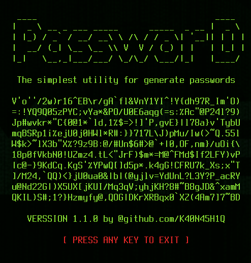

usage: password [-h] [--length [LENGTH]] [--quantity [QUANTITY]]
                [--difficulty [DIFFICULTY]]

The simplest utility for generate passwords

options:
  -h, --help            show this help message and exit
  --length, -l [LENGTH]
                        Length of each password (default is 45)
  --quantity, -q [QUANTITY]
                        Quantity of passwords to generate (default is 10)
  --difficulty, -d [DIFFICULTY]
                        Password difficulty, ranging from 1 to 3 (default is the maximum)
